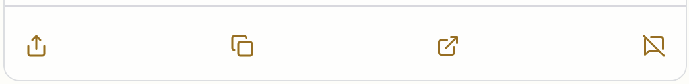

# Browsing your links

To browse the links in your Sill feed, go to [sill.social/links](https://sill.social/links). Here, you can filter, search, and interact with all of the links Sill has collected from the last 24 hours.

## Viewing links and posts

Sill's feed inverts the standard social media feed in two ways. First, it places the link above the post, treating the link as the primary piece of content. Second, it groups posts by the links they reference, so you can easily see everything your network said about a particular link.

To see all of the posts about a particular link, click the "Shared by `n` accounts" button below the link. This will make all of the posts visible for you to read and interact with.

### The toolbar

Both posts and links have a toolbar below them giving you the ability to take action on a particular item.

- **Share**: Clicking the share button will allow you to share the item on Bluesky or Mastodon by opening a new tab with the URL to the item prepopulated in the compose field.
- **Copy**: This button copies the URL of the item to your clipboard.
- **Open in new tab**: This is an explicit "open in new tab" link to the item.
    
    On links, if we have a gift article link, this icon becomes the gift icon, and links directly to a gift URL.

- **Mute**: This allows you to mute this item or add a mute filter based on aspects of this item. For more details, see [the docs on moderation](./moderation.mdx).

## Searching and filtering your feed

Sill offers a few different ways to filter your feed. On mobile, you'll find these filters by tapping the filters button at the bottom of your screen. On desktop, you'll find these filters on the right side of your screen. If you select more than one filter, those filters are **additive**. For example, if you select "Posts from the last 3 hours" and "Exclude reposts", Sill will only show you items from the last 3 hours that are not reposts.

### Search

Use the search bar to search your feed for particular keywords. The search functionality searches on the title, description, and URL of links, as well as post author handles, post author names, and post text.

### Show posts from the last...

You can filter your feed by time. When you select one of these time filters, Sill only looks at posts from your networks in this time range and groups posts by the links they shared. Sill gives you four options:

- Posts from the last 3 hours
- Posts from the last 6 hours
- Posts from the last 12 hours
- Posts from the last 24 hours (default)

### Exclude reposts

By default, Sill includes reposts in your feed. However, You can choose to exclude reposts from Sill's feed through this filter.

### Sort by

By default, Sill sorts links by popularity, or by the number of people in your social network who have shared a particular link. (For more about how we count shares, read about [how Sill works](../how-sill-works.mdx) in depth.) With this filter, you can also sort your feed by time. This will show you links in reverse chronological order by the time they were posted.

### Service

If you have connected both Bluesky and Mastodon, you can use this filter to see only items from one of the two networks. By default, Sill will combine Bluesky and Mastodon together.

### List

If you have [Sill+](/category/sill) and have enabled lists from Bluesky or Mastodon, you can use this filter to see only items from a selected list. By default, Sill pulls in all of your lists as well as your home timeline into the same feed.